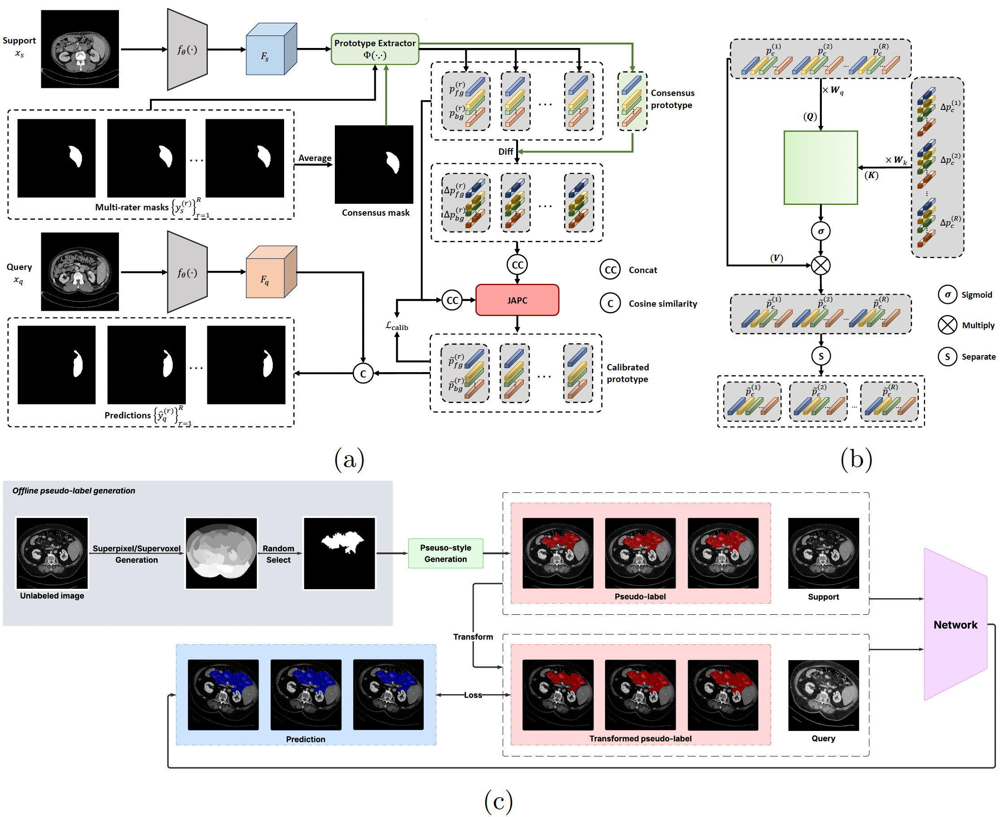

# Attention-Based Prototype Calibration for Multi-Rater Few-Shot Medical Image Segmentation

<p align="center">

[](#)
[](#)
[](#)
[](#)

</p>

Official implementation of:

**Attention-Based Prototype Calibration for Multi-Rater Few-Shot Medical Image Segmentation**

**Truong Vu, Minh Khoi Ho, Yutong Xie**

*MICCAI 2026*

---

## Framework Overview

<p align="center">
  
</p>

<p align="center">
  <em>Overview of the proposed Joint Attention-based Prototype Calibration (JAPC) framework. (a) Few-shot multi-rater segmentation pipeline. Rater-specific and consensus prototypes are extracted from support features, and calibrated by the Joint Attention-based Prototype Calibration (JAPC) module to generate R personalized predictions via cosine similarity with query features. (b) Internal structure of JAPC, modeling structured interactions between rater prototypes and their deviations. (c) Pseudo-style generation. Pseudo labels derived from superpixel/supervoxel segmentation are transformed to synthesize multiple rater-style variants, which are used as support labels and query supervision during training. The “Network” block in (c) corresponds to the full pipeline shown in (a).</em>
</p>

---

## Highlights

* 🚀 First formulation of **Few-Shot Multi-Rater Medical Image Segmentation**
* 🧠 Lightweight **Joint Attention-based Prototype Calibration (JAPC)**
* 👥 Explicit modeling of inter-rater variability in prototype space
* 🔄 Pseudo-style generation for multi-rater supervision
* 📈 Consistent improvements across Abd-CT and Brain-MRI benchmarks

---

## Overview

Most few-shot medical image segmentation methods assume a single annotation per image. However, real clinical datasets often contain multiple expert annotations with systematic differences.

We introduce **Few-Shot Multi-Rater Segmentation**, where the model generates personalized predictions corresponding to multiple annotator styles. Our proposed **JAPC** module calibrates rater-specific prototypes using attention-based interactions while preserving shared semantic structure.

---

## Main Results

### Abd-CT (Setting 1)

| Method                |     DiceK |     DiceP |     DiceL | Mean Dice | Checkpoint |
| --------------------- | --------: | --------: | --------: | --------: | ---------- |
| SSL-ALPNet            |     69.33 |     37.68 |     77.42 |     61.48 | [ckpt_K](https://huggingface.co/truongvu2710/Personalized-FS/resolve/main/runs/mySSL__CURVAS_Superpix_sets_0_1shot/6/snapshots/50000.pth), [ckpt_PL](https://huggingface.co/truongvu2710/Personalized-FS/resolve/main/runs/mySSL__CURVAS_Superpix_sets_1_1shot/82/snapshots/50000.pth)     |
| **SSL-ALPNet + JAPC** | **71.04** | **39.06** | **78.26** | **62.79** | [ckpt_K](https://huggingface.co/truongvu2710/Personalized-FS/resolve/main/runs/mySSL__CURVAS_Superpix_sets_0_1shot/7/snapshots/25000.pth), [ckpt_PL](https://huggingface.co/truongvu2710/Personalized-FS/resolve/main/runs/mySSL__CURVAS_Superpix_sets_1_1shot/74/snapshots/25000.pth)     |
|                       |           |           |           |           |            |
| DSPNet                |     68.03 |     37.96 |     78.58 |     61.52 | [ckpt_K](https://huggingface.co/truongvu2710/Personalized-FS/resolve/main/runs/mySSL__CURVAS_Superpix_sets_0_1shot/30/snapshots/50000.pth), [ckpt_PL](https://huggingface.co/truongvu2710/Personalized-FS/resolve/main/runs/mySSL__CURVAS_Superpix_sets_1_1shot/10/snapshots/50000.pth)     |
| **DSPNet + JAPC**     | **68.63** | **39.09** | **79.03** | **62.25** | [ckpt_K](https://huggingface.co/truongvu2710/Personalized-FS/resolve/main/runs/mySSL__CURVAS_Superpix_sets_0_1shot/19/snapshots/25000.pth), [ckpt_PL](https://huggingface.co/truongvu2710/Personalized-FS/resolve/main/runs/mySSL__CURVAS_Superpix_sets_1_1shot/57/snapshots/25000.pth)     |

### Abd-CT (Setting 2)

| Method                |     DiceK |     DiceP |     DiceL | Mean Dice | Checkpoint |
| --------------------- | --------: | --------: | --------: | --------: | ---------- |
| SSL-ALPNet            |     58.50 |     38.23 |     73.02 |     56.58 | [ckpt_K](https://huggingface.co/truongvu2710/Personalized-FS/resolve/main/runs/mySSL__CURVAS_Superpix_sets_0_1shot/157/snapshots/50000.pth), [ckpt_PL](https://huggingface.co/truongvu2710/Personalized-FS/resolve/main/runs/mySSL__CURVAS_Superpix_sets_1_1shot/2/snapshots/50000.pth)     |
| **SSL-ALPNet + JAPC** | **61.49** | **38.24** | **76.33** | **58.69** | [ckpt_K](https://huggingface.co/truongvu2710/Personalized-FS/resolve/main/runs/mySSL__CURVAS_Superpix_sets_0_1shot/158/snapshots/25000.pth), [ckpt_PL](https://huggingface.co/truongvu2710/Personalized-FS/resolve/main/runs/mySSL__CURVAS_Superpix_sets_1_1shot/3/snapshots/25000.pth)     |
|                       |           |           |           |           |            |
| DSPNet                |     62.24 |     35.32 |     76.77 |     58.11 | [ckpt_K](https://huggingface.co/truongvu2710/Personalized-FS/resolve/main/runs/mySSL__CURVAS_Superpix_sets_0_1shot/152/snapshots/50000.pth), [ckpt_PL](https://huggingface.co/truongvu2710/Personalized-FS/resolve/main/runs/mySSL__CURVAS_Superpix_sets_1_1shot/1/snapshots/50000.pth)     |
| **DSPNet + JAPC**     | **64.10** | **36.78** | **77.98** | **59.62** | [ckpt_K](https://huggingface.co/truongvu2710/Personalized-FS/resolve/main/runs/mySSL__CURVAS_Superpix_sets_0_1shot/55/snapshots/25000.pth), [ckpt_PL](https://huggingface.co/truongvu2710/Personalized-FS/resolve/main/runs/mySSL__CURVAS_Superpix_sets_1_1shot/34/snapshots/25000.pth)    |

### Brain-MRI (Setting 1)

| Method                |      Dice | Checkpoint |
| --------------------- | --------: | ---------- |
| SSL-ALPNet            |     61.37 | [ckpt](https://huggingface.co/truongvu2710/Personalized-FS/resolve/main/runs/mySSL__QUBIQ_BRAIN_GROWTH_1_Superpix_sets_0_1shot/8/snapshots/10000.pth)   |
| **SSL-ALPNet + JAPC** | **65.78** | [ckpt](https://huggingface.co/truongvu2710/Personalized-FS/resolve/main/runs/mySSL__QUBIQ_BRAIN_GROWTH_1_Superpix_sets_0_1shot/9/snapshots/5000.pth)   |
|                       |           |            |
| DSPNet                |     54.02 | [ckpt](https://huggingface.co/truongvu2710/Personalized-FS/resolve/main/runs/mySSL__QUBIQ_BRAIN_GROWTH_1_Superpix_sets_0_1shot/1/snapshots/10000.pth)   |
| **DSPNet + JAPC**     | **66.62** | [ckpt](https://huggingface.co/truongvu2710/Personalized-FS/resolve/main/runs/mySSL__QUBIQ_BRAIN_GROWTH_1_Superpix_sets_0_1shot/5/snapshots/5000.pth)   |

---

## Installation

```bash
git clone https://github.com/truong2710-cyber/Personalized-FS.git
cd Personalized-FS

conda create -n japc python=3.9
conda activate japc

pip install -r requirements.txt
```

---

## Dataset Preparation

We evaluate on two multi-rater medical image segmentation datasets:

* **CURVAS (Abd-CT)**
* **QUBIQ Brain-Growth (Brain-MRI)**

### 1. Organize Raw Data

Place the downloaded images and annotations into their corresponding directories:

```text
data/CURVAS/
data/QUBIQ/
```

### 2. QUBIQ Only: Fix Dataset Structure

The original QUBIQ release requires an additional preprocessing step to reorganize the data structure:

```bash
bash fix_data_structure.sh
```

### 3. Preprocess the Datasets

For both datasets, run the preprocessing scripts in the following order:

```text
intensity_normalization.py
resampling_and_roi.py
class_map.py
```

These scripts normalize image intensities, resample scans to the target resolution, crop the region of interest, and generate class-index mappings required by the dataloaders.

### 4. Generate Pseudo Labels

Generate superpixel-based pseudo labels using:

```text
data/pseudolabel_gen.ipynb
```

### Notes

* The generated `classmap_*.json` files indicate which slices contain each semantic class and are required for few-shot episode sampling.
* Custom pseudo-label generation pipelines may also be used, provided that the resulting masks follow the same format as the supplied preprocessing code.

---

## Training

```bash
python training.py
```

Important configuration options:

| Parameter         | Description             |
| ----------------- | ----------------------- |
| dataset           | Dataset name            |
| label_sets        | Training label split    |
| exclude_cls_list  | Unseen test classes     |
| calib_wt          | Calibration loss weight |
| num_pseudo_raters | Number of pseudo raters |
| reload_model_path | Pretrained checkpoint   |
| use_attention     | Enable JAPC             |

---

## Evaluation

```bash
python validation.py
```

---

## Repository Structure

```text
.
├── data/
├── dataloaders/
├── models/
├── scripts/
├── runs/
├── training.py
├── validation.py
└── config_ssl_upload.py
```

---

## Citation

```bibtex
@inproceedings{vumiccai2026,
  title={Attention-Based Prototype Calibration for Multi-Rater Few-Shot Medical Image Segmentation},
  author={Vu, Truong and Ho, Minh Khoi and Xie, Yutong},
  booktitle={Medical Image Computing and Computer Assisted Intervention (MICCAI)},
  year={2026}
}
```

---

## Acknowledgements

This repository builds upon:

* DSPNet (MedIA 2025)
* SSL-ALPNet (ECCV 2020)

We thank the original authors for making their code publicly available.